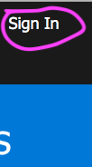
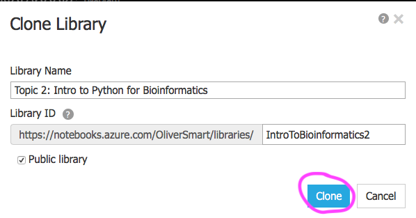

### Topic 2 Intro to Python for Bioinformatics

* This topic introduces programming in python showing how sequence information can be stored and manipulated in strings. 
* Before beginning the topic, students should have completed
  [DataCamp online course Intro to Python for Data Science](https://www.datacamp.com/courses/intro-to-python-for-data-science)
  sections 1, 2 and 3 (estimated three hours work).
* To start working with Azure Notebooks you will need to sign in by clicking on the `Sign In` link at the top right of this window:

* At the `Microsoft Sign in` page enter your Anglia Ruskin Username that should be in the format **abc123@student.anglia.ac.uk**
* You will then be redirected to a Anglia Ruskin sign in page, enter your ARU password.
* Once you have logged in you need to Clone the library into your space by clicking on the `Clone` button:
  
"

* In the Clone Library prompt accept the defaults by clicking on the `Clone` button:

"

* The `Public library` tick option means that other people can view your work if you share the url of your library.
* N.B., you should only clone library once to avoid overwriting your work!
* Start by working through the notebook: [0_introducing_jupyter_notebook.ipynb](./0_introducing_jupyter_notebook.ipynb)
